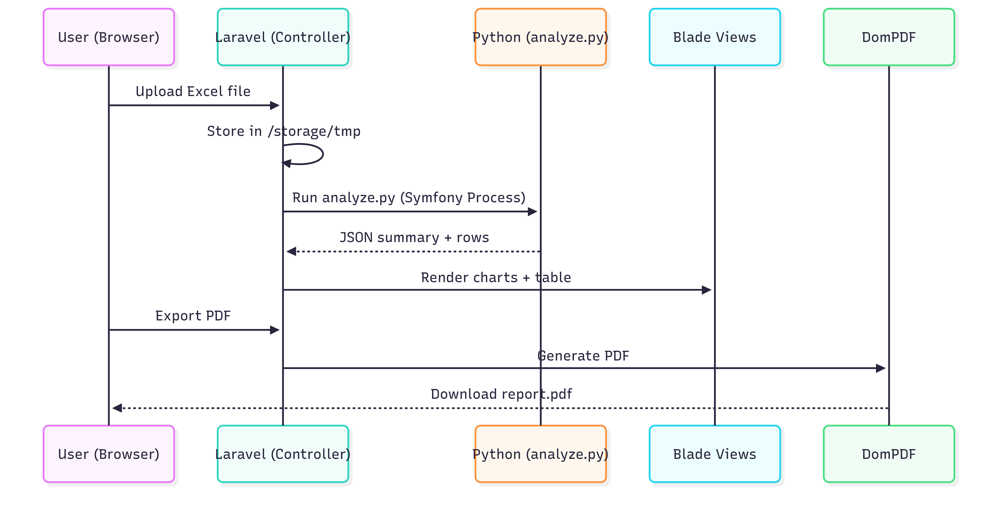
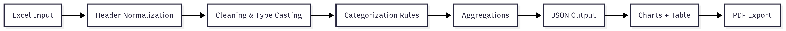
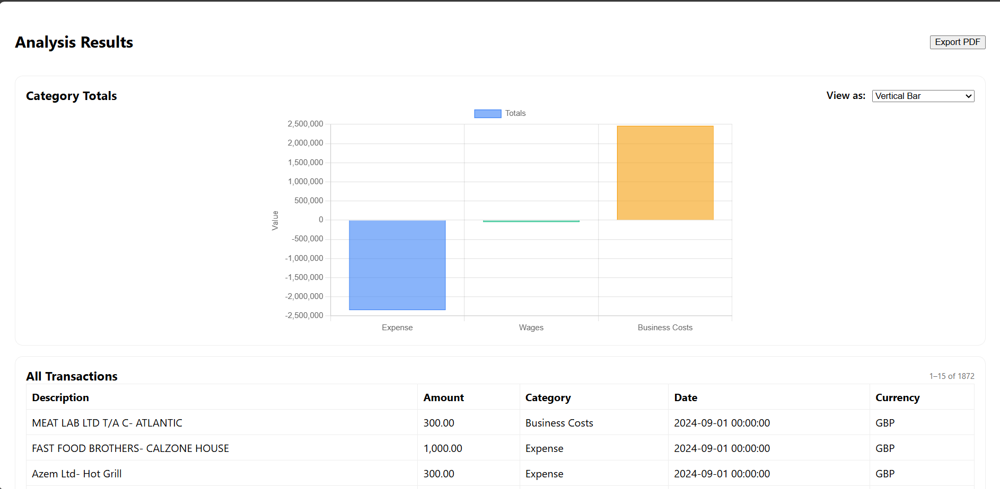
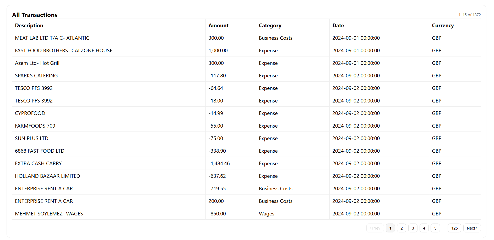

# Data Analyzer

Analyze your Excel transaction data in seconds!</b><br>
Upload, categorize, visualize through variation of charts, and export your financial data with ease.</b><br>

A Laravel + Python hybrid app to upload Excel/CSV data, analyze it, categorize transactions, and generate visual reports with charts and PDFs.

---

## 🚀 What is Data Analyzer?

**Data Analyzer** is a web application that lets you upload Excel files containing transaction data, then automatically analyzes, categorizes, and visualizes your spending. It provides instant summaries, interactive charts, and lets you export your results as a PDF.

---

## 🎯 Purpose

- **Automate** the process of categorizing and summarizing financial transactions from Excel files.
- **Visualize** your spending by category with interactive charts.
- **Export** your analysis as a professional PDF report.
- **No manual data entry** — just upload and get insights!

---

## 🧐 Why use this project?

- **Save time:** No more manual sorting or Excel formulas.
- **Instant insights:** See where your money goes, spot trends, and get summaries.
- **Easy to use:** Simple upload form, clear results, and export options.
- **Customizable:** Built with Laravel and Python, so you can extend or adapt it for your needs.

---

## 📦 Features

- Upload `.xlsx` or `.xls` files with transaction data.
- Automatic column normalization and error handling.
- Smart categorization of transactions (Wages, Business Costs, Expense, etc.).
- Interactive charts (bar, pie, line, and more) using Chart.js.
- Paginated transaction tables for easy browsing.
- Export results as a clean, printable PDF.
- Works locally — your data stays private.

---

## 🛠 Frameworks Used

- **Laravel 10 (PHP 8)** – Web framework for UI & backend orchestration.
- **Python 3.13** – Data analysis and Excel parsing.
- **Pandas + OpenPyXL** – Data processing libraries.
- **Symfony Process** – Laravel ↔ Python integration.
- **Chart.js** – Charting library for frontend visualization.
- **Laravel-Dompdf** – PDF export.
- **Laragon** – Local dev environment (PHP, MySQL, Apache/Nginx).
---

## 📝 Expected Excel Format

Your Excel file should have at least these columns:

- **MainDesc** (main description)
- **AddDesc** (additional description)
- **Amount**

Optional columns:

- **Date**
- **SpendCategory**
- **Currency**

---

## 📂 Project Scaffold & Structure

```text
.
├─ app/                     # Laravel app code (Controllers, Models, Services)
│  ├─ Http/
│  │  ├─ Controllers/       # Handles upload, dispatch to Python, returns views
│  │  └─ Middleware/
│  ├─ Models/               # Eloquent models (if used)
│  └─ Services/             # Orchestration logic (optional)
├─ bootstrap/               # Laravel bootstrap files
├─ config/                  # Laravel configuration
├─ database/                # Migrations/seeders
├─ public/                  # Public assets
├─ python/                  # Python analysis pipeline
│  ├─ analyze.py            # Reads Excel, applies rules, outputs JSON
│  ├─ requirements.txt      # pandas, openpyxl, xlrd
│  └─ utils/                # Helpers (cleaning, categorization)
├─ resources/
│  ├─ views/                # Blade templates (upload form, results, charts)
│  └─ js/                   # Optional JS assets
├─ routes/
│  └─ web.php               # App routes
├─ storage/                 # Framework & app storage
├─ tests/                   # PHPUnit tests
├─ .env.example             # Env template
├─ composer.json            # PHP dependencies
├─ package.json             # Frontend deps (if any)
└─ README.md
```
---
## Execution Flow
<br>

---
## Data Pipeline
<br>

---

## ⚡️ Quick Start

### 1. Clone the repository

```bash
git clone https://github.com/yourusername/Data_Analyzer.git
cd Data_Analyzer
```

### 2. Install PHP & Composer dependencies

```bash
composer install
```

### 3. Install Python dependencies

Make sure you have Python 3.9+ and pip installed.

```bash
pip install -r requirements.txt
```

> **Note:** If you use a virtual environment, activate it first.

### 4. Set up your environment

Copy `.env.example` to `.env` and set your app key:

```bash
cp .env.example .env
php artisan key:generate
```

### 5. Run the application

```bash
php artisan serve
```

Visit [http://localhost:8000](http://localhost:8000) in your browser.

---

## 🖼️ Screenshots

<p align="center">
<h3>Charts Screen</h3>
  <br><br>
<h3>Transaction Table Screen</h3>
  
</p>

---

## 🛠️ How it works

1. **Upload:** You upload your Excel file via the web form.
2. **Analyze:** The backend (Python script) reads and processes your file, categorizes transactions, and summarizes totals.
3. **Visualize:** Results are shown with interactive charts and tables.
4. **Export:** You can export the analysis as a PDF report.

---

## 🧩 Tech Stack

- **Backend:** Laravel (PHP)
- **Data Processing:** Python (pandas)
- **Frontend:** Blade templates, Chart.js
- **PDF Export:** DomPDF

---

## 🐍 Python Requirements

- `pandas`
- `openpyxl`
- `xlrd==1.2.0` (for `.xls` support)

Install with:

```bash
pip install pandas openpyxl xlrd==1.2.0
```

---

## 🤝 Contributing

Pull requests and suggestions are welcome! Please open an issue or submit a PR.

---

## 📄 License

This project is open-sourced under the [MIT license](LICENSE).

---

## 💡 Credits

- Built with [Laravel](https://laravel.com/) and [pandas](https://pandas.pydata.org/)
- Charting by [Chart.js](https://www.chartjs.org/)
- PDF export via [DomPDF](https://github.com/dompdf/dompdf)

---

<p align="center">
  <b>Made with ❤️ for data enthusiasts</b>
